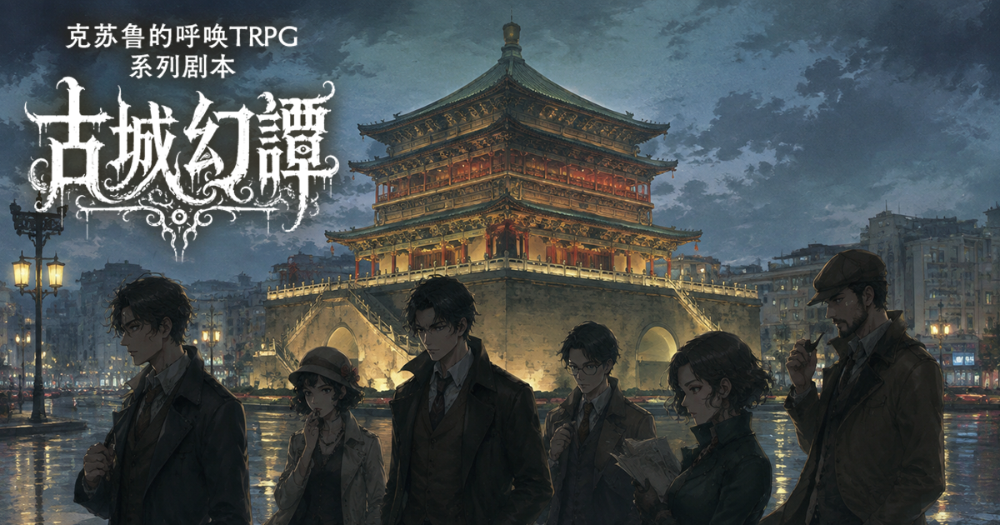
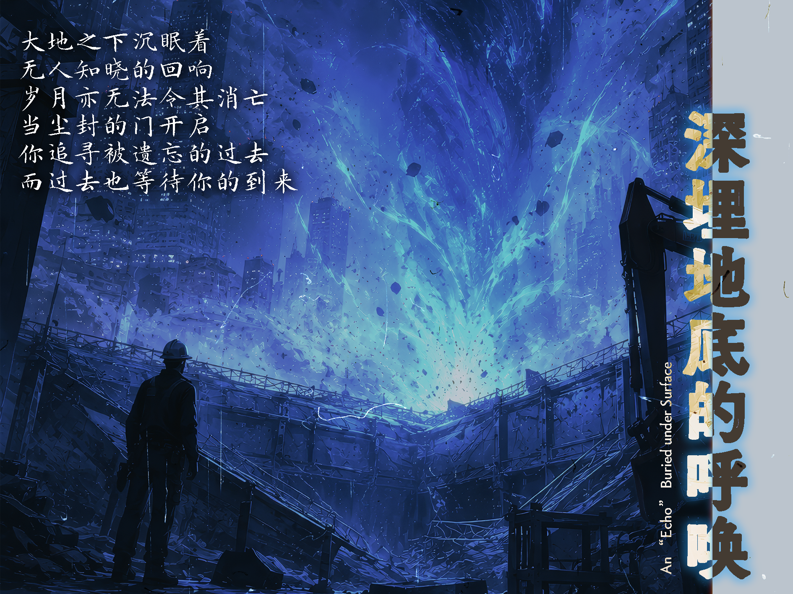
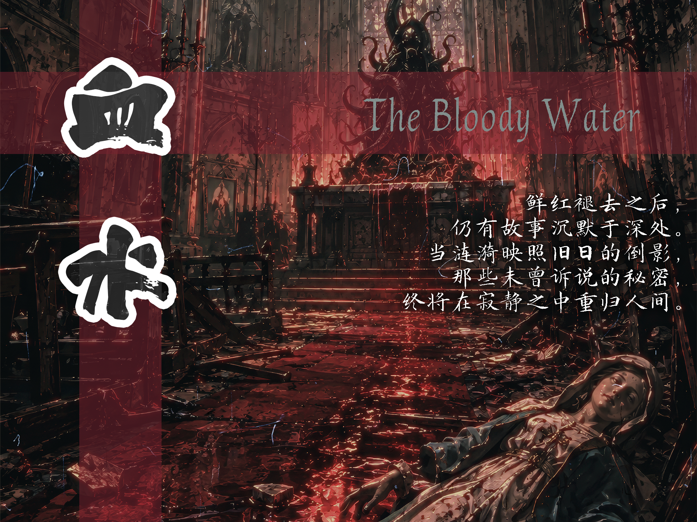
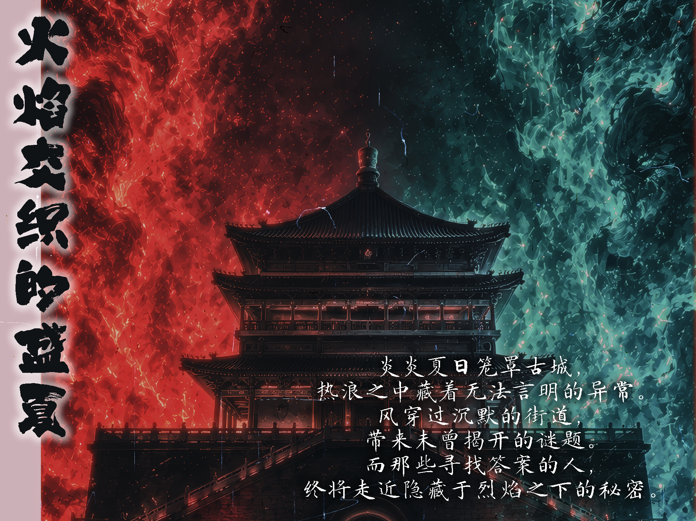
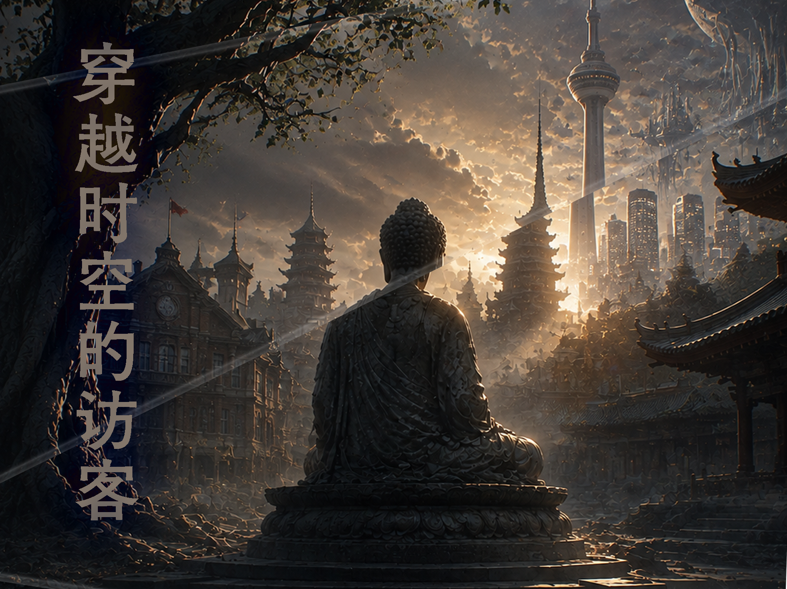
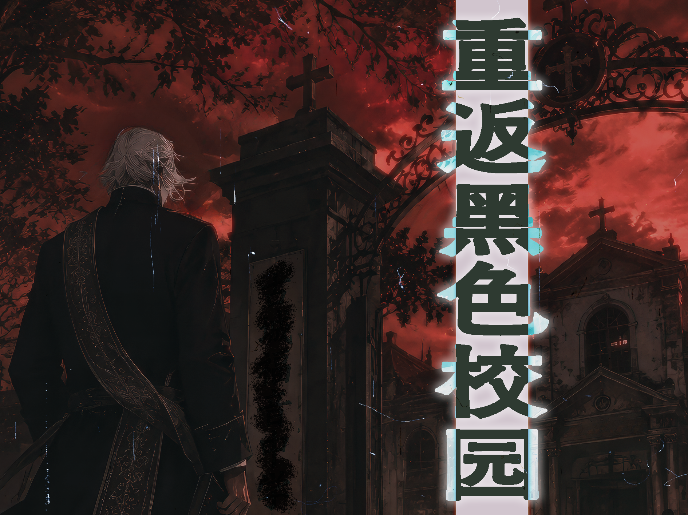

---

 某处，在中国中部、关中平原的腹地， 静卧着一座名为「古城市」的都市。 它既是车水马龙的千年古都， 也是现代造物与古代遗物交错纵横的城市——  摩天楼与古城墙并肩，烟火气与旧日的秘密共生。 在这座城市日复一日的寻常表象之下， 神话存在们正屏息蛰伏……  调查员们，当你们踏入古城市， 将与怎样的幻谭相遇—— 

---

## “古城幻谭”是什么？

以位于中国的架空（也许？）城市·古城市为舞台展开的适用于《克苏鲁的呼唤 桌面角色扮演游戏 第7版》（COC TRPG 7th）的系列剧本。

古城市是一座在现代化浪潮中突飞猛进、地下却埋藏着无数历史遗物的古城；本系列以这座城里“日常与幻谭仅一线之隔”的特质为基调，将古城市化作若干个富含中国本土特色的短篇至中篇 COC TRPG 剧本。

从身经百战、早已与不可名状之物打过照面的老手，到初次踏入古城市的新人——无论何种玩家，都能在此找到属于自己的不可名状的冒险体验。

更进一步——所有剧本共享“古城市”这一同一舞台：这些剧本既可以单独成局，也可由守密人挑选若干篇共同组成长线战役。同一群调查员，便能在古城市里一待就是好几段人生，把散落的故事慢慢连成一条线。

那么，欢迎你走进古城市—— 属于你自己的下一则幻谭，敬请亲手续写。

---

## 关于“古城市”

古城市是一座位于中国中部偏西的虚构（也许？）城市，地处关中平原腹地，面积约一万平方千米，常住人口约一千万人。古城市南边依靠古南山脉，市内河流密集。

由于曾是数代王朝的都城，古城市有着极为丰厚的历史底蕴。除去遍布在城市的古建筑与遗址之外，古城市的地下不知埋藏着多少历史的遗物——以及不为人知的秘密。城市的地铁施工、旧城改造与房地产开发，时常会意外触及那些沉眠于地下的东西。

古城市既有千年古都的厚重感，又是一座在现代化进程中突飞猛进的都市。摩天大楼与古城墙并肩而立，地铁隧道与古代陵墓交错纵横。对于调查员而言，这座城市本身就充满了探索的价值与危险。

 <a class="download-button no-styling" href="https://pan.baidu.com/s/1f4H1c7be7mjZ1ah4vqzOxQ?pwd=NOAH" target="_blank" rel="noopener noreferrer">详细的古城市设定集</a>

:::warning[注意]
设定集中包含对剧本内容可能产生剧透的内容，如果你是玩家则请勿阅读。
:::

---

## 剧本一览

---

### 校园黑色怪谈

喂，你听说过我们学校的怪谈故事吗？

古城中学，一所拥有悠久历史的高中。近年来，校园中接连发生的异常事件，让这座本应平静的学府蒙上了一层阴影。

为了调查隐藏在校园中的秘密，你们踏入了这片熟悉又陌生的地方。

等待你们的，是被遗忘的过去与无法解释的怪谈……

 <a class="download-button no-styling" href="/posts/%E5%8F%A4%E5%9F%8E%E8%AF%A1%E7%A7%98_remaster/" target="_blank" rel="noopener noreferrer">收录于《古城诡秘》剧本集中，点击查看</a>

---

### 深埋地底的呼唤

听说地铁施工又要延期了……好像是挖出来了古代遗迹

在古城的一角，一段被岁月掩埋的历史重新浮现。一次偶然的发现，将你们引向地底深处。

随着调查逐渐深入，你们将在遗迹与传闻之间寻找隐藏的真相。

沉睡于黑暗之下的秘密，究竟等待着你们的是什么？

 <a class="download-button no-styling" href="/posts/%E5%8F%A4%E5%9F%8E%E8%AF%A1%E7%A7%98_remaster/" target="_blank" rel="noopener noreferrer">收录于《古城诡秘》剧本集中，点击查看</a>

---

### 可曾遇见梦中仙境

也许……我们只是在梦游吧

最近，你们开始经历一些无法解释的梦境。那些陌生的景象、模糊的记忆，以及现实中逐渐出现的异常，让你们踏上了一场追寻梦境真相的旅途。

当现实与幻想的界限逐渐消失，你们所见到的“仙境”究竟意味着什么？

 <a class="download-button no-styling" href="/posts/%E5%8F%A4%E5%9F%8E%E8%AF%A1%E7%A7%98_remaster/" target="_blank" rel="noopener noreferrer">收录于《古城诡秘》剧本集中，点击查看</a>

---

### 血水

我的丈夫和孩子失踪了，就在那座废弃教堂附近……

在古城市北部的郊区，一家三口在假日出游时毫无征兆地失去了踪影。身为侦探或调查员的你接受委托，前往那片被遗忘的土地，在一座古老废弃的教堂周围寻找他们的下落。

随着调查的深入，一些不该存在的痕迹逐渐浮现。那些隐藏在阴影中的信徒、被岁月掩埋的秘密，以及某种蠢蠢欲动的阴谋，正将你们一步步拖入深渊……

 <a class="download-button no-styling" href="/posts/%E5%8F%A4%E5%9F%8E%E7%A7%98%E5%8F%B2/" target="_blank" rel="noopener noreferrer">收录于《古城秘史》剧本集中，点击查看</a>

---

### 火焰交织的盛夏

天公不作美，今年夏天真要热死人了！

古城市迎来了有记载以来最炎热的夏天。烈日炙烤着街道，整座城市在异常高温中陷入停滞。气象学家束手无策，市民们闭门不出，而某些角落里，关于“翡翠色火焰”的传闻开始在网络上悄然流传。

当热浪与古老的仪式交织在一起，你们将发现，这场酷暑的背后隐藏着远比自然灾害更为恐怖的存在。

 <a class="download-button no-styling" href="/posts/%E5%8F%A4%E5%9F%8E%E7%A7%98%E5%8F%B2/" target="_blank" rel="noopener noreferrer">收录于《古城秘史》剧本集中，点击查看</a>

---

### 穿越时空的访客

古城的历史，静静等待着被重新唤醒……

雁塔之下，两本尘封千年的古籍重见天日。随之而来的，还有一位来自遥远未来的神秘访客。在他的指引下，你们将借助古老仪式“彼岸之旅”，穿梭于现实与过去之间，追寻古城市危机的源头。

在一次次时空回溯中，你们将逐渐揭开一段被掩盖了千年的真相——以及那位西行僧人身上发生的离奇事件。

 <a class="download-button no-styling" href="/posts/%E5%8F%A4%E5%9F%8E%E7%A7%98%E5%8F%B2/" target="_blank" rel="noopener noreferrer">收录于《古城秘史》剧本集中，点击查看</a>

---

### 重返黑色校园

几十年前的校园，又是另一番模样。

时间回到二十世纪四十年代，你们是以警察或政府职员身份被派遣到古城福音中学的调查员。在战乱与动荡的年代里，这所学校接连发生学生失踪事件，而官方的调查却始终停滞不前。

当你们踏入这座古老的校园，会发现某些信仰从未真正消失。禁忌的知识、伪装的虔诚，以及潜伏在黑暗中的邪恶，正在等待着新的祭品。

 <a class="download-button no-styling" href="/posts/%E5%8F%A4%E5%9F%8E%E7%A7%98%E5%8F%B2/" target="_blank" rel="noopener noreferrer">收录于《古城秘史》剧本集中，点击查看</a>

---

### 早八要迟到了

再排下去，早八就要迟到了。

周一早晨，古城科技大学的教学楼前排起了令人绝望的长队。手持“测温枪”的工作人员堵住了入口，学生们怨声载道，而距离第一节课开始只剩下不到十分钟。

在这看似只是学校行政昏招的混乱背后，某种非物质的色彩正蛰伏于校园地下。为了不被扣出勤分，也为了弄清真相，你们决定展开调查。

 <a class="download-button no-styling" href="/posts/%E5%8F%A4%E5%9F%8E%E7%A7%98%E5%8F%B2/" target="_blank" rel="noopener noreferrer">收录于《古城秘史》剧本集中，点击查看</a>

---

### 奈落之蛹

最可怕的东西，有时就藏在我们身边。

古科附中的一名初中女生和一名小学男生在同一天夜里失踪。警方迅速介入，却在上级的压力下被引导向错误的方向。作为被信任的友人或私家侦探，你们加入了这场与时间赛跑的搜救。

随着调查深入，你们将发现绑架案的背后是一连串被掩盖的罪行，以及一种能够侵蚀人心智的可怕生物。要拯救孩子们，你们必须直面那些长久以来被视而不见的东西。

 <a class="download-button no-styling" href="/posts/%E5%8F%A4%E5%9F%8E%E7%A7%98%E5%8F%B2/" target="_blank" rel="noopener noreferrer">收录于《古城秘史》剧本集中，点击查看</a>