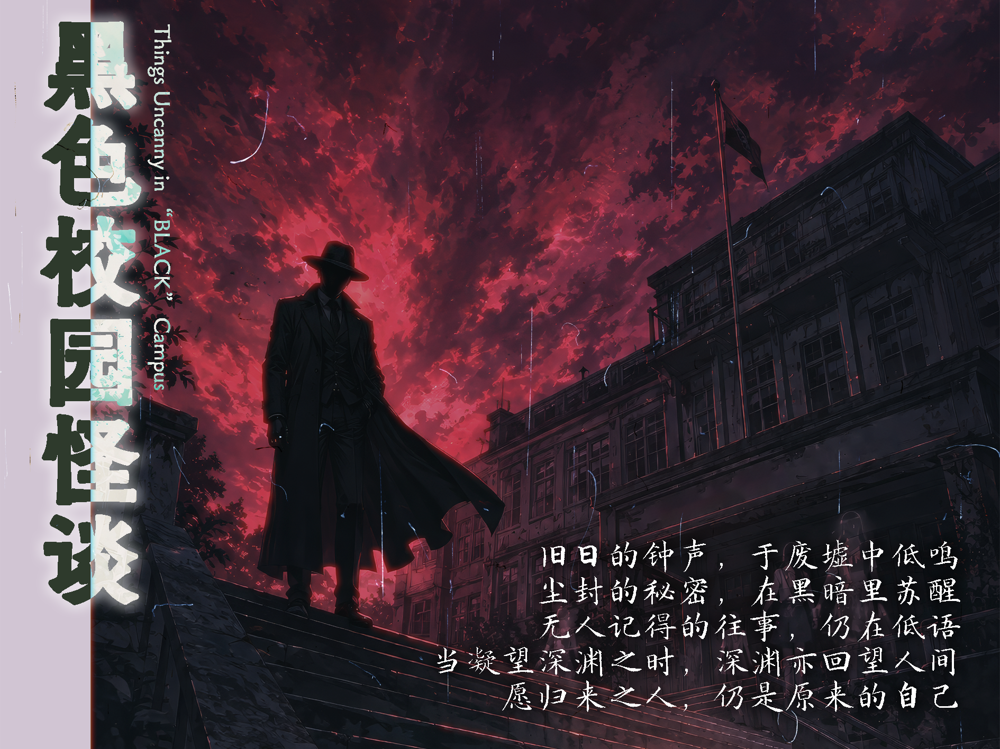
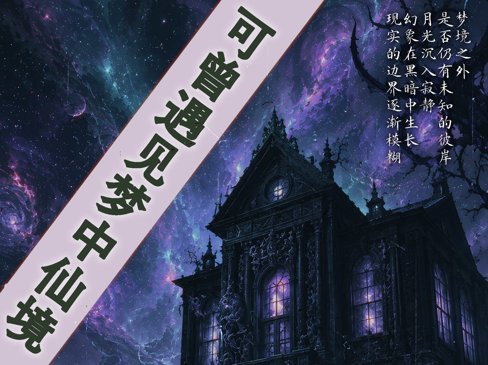

---

 某处，在中国中部、关中平原的腹地， 静卧着一座名为「古城市」的都市。 它既是车水马龙的千年古都， 也是现代造物与古代遗物交错纵横的城市——  摩天楼与古城墙并肩，烟火气与旧日的秘密共生。 在这座城市日复一日的寻常表象之下， 神话存在们正屏息蛰伏……  调查员们，当你们踏入古城市， 将与怎样的幻谭相遇—— 

---

## “古城幻谭”是什么？

以位于中国的架空（也许？）城市·古城市为舞台展开的适用于《克苏鲁的呼唤 桌面角色扮演游戏 第7版》（COC TRPG 7th）的系列剧本。

古城市是一座在现代化浪潮中突飞猛进、地下却埋藏着无数历史遗物的古城；本系列以这座城里“日常与幻谭仅一线之隔”的特质为基调，将古城市化作若干个富含中国本土特色的短篇至中篇 COC TRPG 剧本。

从身经百战、早已与不可名状之物打过照面的老手，到初次踏入古城市的新人——无论何种玩家，都能在此找到属于自己的不可名状的冒险体验。

更进一步——所有剧本共享“古城市”这一同一舞台：这些剧本既可以单独成局，也可由守密人挑选若干篇共同组成长线战役。同一群调查员，便能在古城市里一待就是好几段人生，把散落的故事慢慢连成一条线。

那么，欢迎你走进古城市—— 属于你自己的下一则幻谭，敬请亲手续写。

---

## 关于“古城市”

古城市是一座位于中国中部偏西的虚构（也许？）城市，地处关中平原腹地，面积约一万平方千米，常住人口约一千万人。古城市南边依靠古南山脉，市内河流密集。

由于曾是数代王朝的都城，古城市有着极为丰厚的历史底蕴。除去遍布在城市的古建筑与遗址之外，古城市的地下不知埋藏着多少历史的遗物——以及不为人知的秘密。城市的地铁施工、旧城改造与房地产开发，时常会意外触及那些沉眠于地下的东西。

古城市既有千年古都的厚重感，又是一座在现代化进程中突飞猛进的都市。摩天大楼与古城墙并肩而立，地铁隧道与古代陵墓交错纵横。对于调查员而言，这座城市本身就充满了探索的价值与危险。

 <a class="download-button no-styling" href="https://pan.baidu.com/s/1f4H1c7be7mjZ1ah4vqzOxQ?pwd=NOAH" target="_blank" rel="noopener noreferrer">详细的古城市设定集</a>

:::warning[注意]
设定集中包含对剧本内容可能产生剧透的内容，如果你是玩家则请勿阅读。
:::

---

## 剧本一览

---

### 校园黑色怪谈

喂，你听说过我们学校的怪谈故事吗？

古城中学，一所拥有悠久历史的高中。近年来，校园中接连发生的异常事件，让这座本应平静的学府蒙上了一层阴影。

为了调查隐藏在校园中的秘密，你们踏入了这片熟悉又陌生的地方。

等待你们的，是被遗忘的过去与无法解释的怪谈……

 <a class="download-button no-styling" href="/posts/%E5%8F%A4%E5%9F%8E%E8%AF%A1%E7%A7%98_remaster/" target="_blank" rel="noopener noreferrer">收录于《古城诡秘》剧本集中，点击查看</a>

---

### 深埋地底的呼唤

听说地铁施工又要延期了……好像是挖出来了古代遗迹

在古城的一角，一段被岁月掩埋的历史重新浮现。一次偶然的发现，将你们引向地底深处。

随着调查逐渐深入，你们将在遗迹与传闻之间寻找隐藏的真相。

沉睡于黑暗之下的秘密，究竟等待着你们的是什么？

 <a class="download-button no-styling" href="/posts/%E5%8F%A4%E5%9F%8E%E8%AF%A1%E7%A7%98_remaster/" target="_blank" rel="noopener noreferrer">收录于《古城诡秘》剧本集中，点击查看</a>

---

### 可曾遇见梦中仙境

也许……我们只是在梦游吧

最近，你们开始经历一些无法解释的梦境。那些陌生的景象、模糊的记忆，以及现实中逐渐出现的异常，让你们踏上了一场追寻梦境真相的旅途。

当现实与幻想的界限逐渐消失，你们所见到的“仙境”究竟意味着什么？

 <a class="download-button no-styling" href="/posts/%E5%8F%A4%E5%9F%8E%E8%AF%A1%E7%A7%98_remaster/" target="_blank" rel="noopener noreferrer">收录于《古城诡秘》剧本集中，点击查看</a>

---