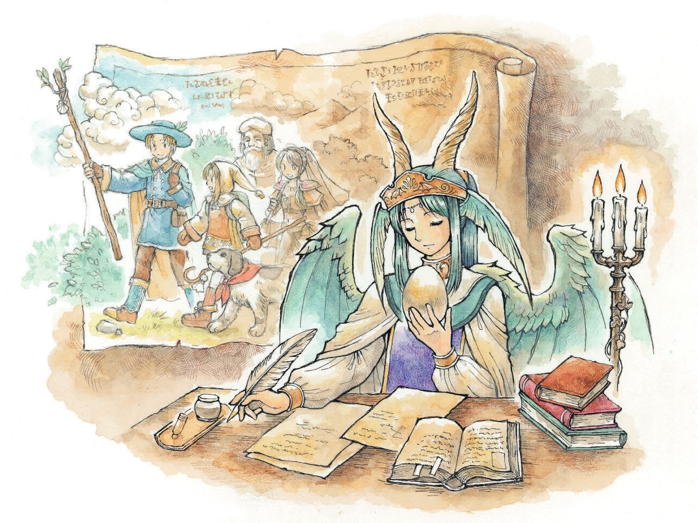
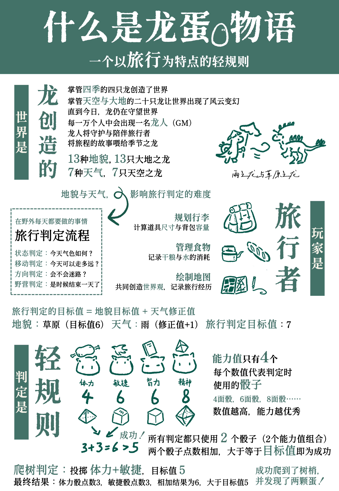
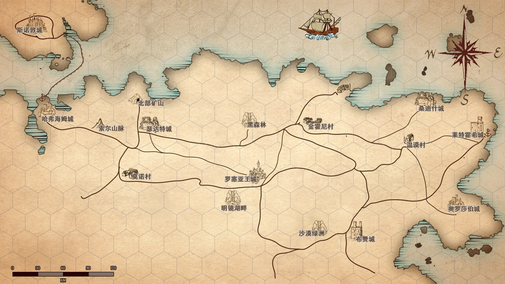
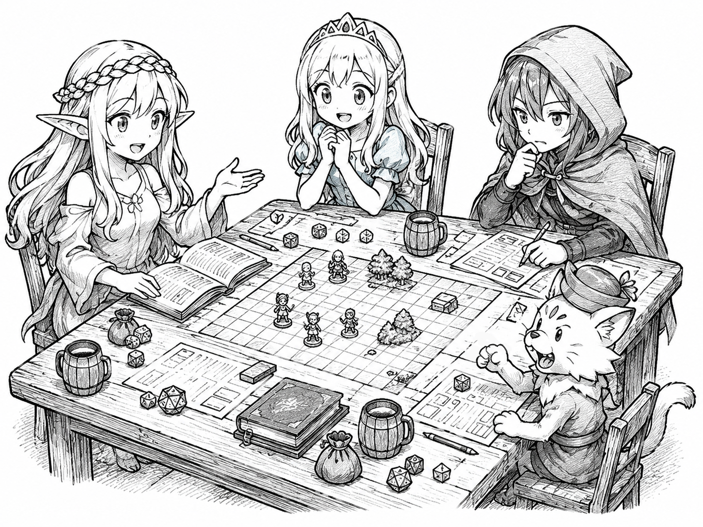

 谨以此剧本集献给《Marumaru。》 ——为我开启奇幻世界大门的游戏作品。

---

## 顺利完成众筹！

**剧本集的全新修订增补本更名为《◯◯大陆的奇妙旅行》，已在摩点平台完成众筹！**

以往众筹的《龙蛋物语》简体中文版规则书、扩展、剧本及其他游戏配件，也将一并开启新一轮众筹。

 <a class="download-button no-styling" href="https://m.modian.com/project/152508.html" target="_blank" rel="noopener noreferrer">前往摩点页面</a>

---

## 什么是《龙蛋物语》

人在一生中，总要进行一次让自己心潮澎湃的旅行。

以季节、龙、旅行为主题的奇幻RPG

创造了这个世界及整个自然界的，是掌管春夏秋冬的四条龙。而掌管天地的二十条龙则创造了美丽的大地和气候。一切都从掌管季节和天地的众龙那里开始。即使是现在，这些龙也在看顾着世界……

由玩家（旅行者）和主持人（龙人）共同编织的故事

玩家基于猎人、商人、吟游诗人等七种职业创造角色，踏上旅程。在这个世界上，人们的第一次旅行会得到国家的支持。但是，这个世界里有诸多险峻的地形，也有怪物出没，对于旅行并不是那么友好。

另一方面，游戏主持人不仅需要准备剧本、组织跑团，同时也要创造“龙人”这一角色，参与游戏。龙人拥有不可思议的力量，是这个世界的母亲，会守护旅行者、引导旅行者。

“季节之龙”会吃下旅行者和龙人共同编织的旅行故事,让世界变得更加丰饶……

### 由煎蛋躺在平底锅制作的《龙蛋物语》规则概览图

> 转载自[煎蛋躺在平底锅的 Dicecho 投稿](https://next.dicecho.com/en/scenario/692c149e612975eb0dea0d3e)
>

---

## 作者手记

这片大陆的故事，是由旅行者和龙人书写的，◯◯是为你们留下的空白。

它也是一个三关谐音梗：

其形为「空」

——两个圆圈，代表等待填充的未知大陆。

其音为「马鹿」（ばか, Baka）

——日语中的"笨蛋"，一个笨拙作者的献礼，等待与你相遇。

其意为「呆萌」

——"马鹿"本是一种神态憨厚、惹人喜爱的鹿，恰如这片大陆孕育的纯真与奇遇。

故事的笔，已交到你们手中。请为这片大陆，填上属于你的名字。

---

## 剧本集简介

- **适用规则**：《龙蛋物语》TRPG 规则
- **推荐人数**：2–4 人（1 位主持人 + 2–4 位玩家）
- **剧本类型**：战斗 & 探索
- **游戏时长**：每章节约 6–8 小时，共 4 章节
- **推荐等级**：龙人 Lv.1 / 旅行者 Lv.1（若旅行者等级较高，龙人可酌情调整魔物与判定难度）

《马鹿的奇妙旅行》剧本集包含 4 个剧本，适合 1 位主持人带领 2–4 位玩家进行游戏。每个剧本大约需时为 6–8 小时，建议分为 2–4 节进行游玩。如果旅行者等级较高，请龙人对剧本中出现的魔物进行调整，并适当地提升部分判定难度。

---

## 欢迎来到马鹿大陆

欢迎来到《马鹿的奇妙旅行》——一场融合冒险、理解与成长的奇幻旅程！

在这片名为"马鹿大陆"的广袤土地上，人类、精灵、犬人与喵布林长久以来和谐共处，共享和平与安宁。然而，一场突如其来的动荡打破了这份宁静：犬人与喵布林开始袭击人类、掠夺村庄，甚至在城市中引发骚乱。罗塞亚王国的国王发出诏令，号召勇敢的旅行者踏上征程，揭开这场异变背后的真相。

马鹿大陆是一片广阔的大陆，人类、精灵、犬人和喵布林在这片大陆上和睦地生活在一起。这里的绝大多数居民向往着和平，安心地居住着、旅行着。然而近期不知道发生了什么变故，一些犬人和喵布林突然开始袭击人类、掠夺人类的村庄，或在城市里喧闹。

统治整个马鹿大陆的"罗塞亚王国"的国王向各地的村庄和城市颁发诏令，鼓励旅行者们踏上自己的旅途，并找到犬人和喵布林暴动的原因。

你们的故事，将从这里开始。

---

## 四段旅途

《马鹿的奇妙旅行》是一场充满温度的旅途，包含四段风格各异的故事。

### 旅行者启程！森之精灵与暴躁的大人

旅行者们应召前往瑟达特城，调查犬人骚乱的源头。他们的线索指向了城外的黑森林，以及其中隐居的森之精灵。这片安静深邃的森林中隐藏着冲突的真正起因，等待着旅行者揭开。

### 小小战争！人类与喵布林的村庄

在偏远的温谟村，人类与喵布林世代相传的共存契约正面临破裂。旅行者们被卷入这场日益紧张的纷争，在信任与质疑之间做出自己的判断——他们的选择，将决定整个村庄的未来。

### 紧急情况！离家出走的任性公主

王国公主突然失踪，国王悬赏找回公主。旅行者在机缘巧合下与公主相遇，却发现她离宫出走的背后，有着复杂的个人原因。是取得国王的悬赏，还是尊重公主的意志，成为了摆在队伍面前的抉择。

### 久远的传说…沉湎于过往的悲哀之龙

一段关于黑龙与罗塞亚的古老传说，指引着旅行者们远渡重洋，前往被冰雪覆盖的北之岛。在那里，他们将直面一段被尘封的往事，探寻传说背后被遗忘的真实。

---

 真巧，我们又见面了。 这几天旅行遇到的事情，不妨和我讲讲？

 <a class="download-button no-styling" href="/posts/marumaru%E7%9A%84%E5%A5%87%E5%A6%99%E6%97%85%E8%A1%8C%E5%89%A7%E6%9C%AC%E9%9B%86/" target="_blank" rel="noopener noreferrer">查看剧本集发布页</a>

---

## 旅途的继续

旅行者的旅途还未结束。

《马鹿的悠哉旅行》是承续了《马鹿的奇妙旅行》的基本设定和世界观，但又相对独立的一系列剧本组成的剧本集。目前《马鹿的悠哉旅行》中的前2篇剧本《于白银雪原追寻极光之旅》和《于回风峡放飞信鸢之旅》已经在 Dicecho 和本博客发布。

### 于白银雪原追寻极光之旅

> 这是一座几乎没有四季的城市，雪花几乎整年伴随着雪之龙飞舞在天空之中。在一望无际的白色雪原中，一座小小的城市安静地坐落在冰天雪地之中。
> 
> 城市北部的雪原的尽头是充满危险又引人向往的极光海岸，峡谷上空时常会浮现出绚丽的极光。传说对着极光许下的愿望会在不久之后实现！许多旅行者或为了一览极光的美景，或为了心愿成真，于这白银雪原踏上追寻极光之旅。然而，美丽的极光并非对所有旅行者都敞开怀抱——只有那些心怀纯净信念和无畏勇气的人，才能穿越雪原和冰崖的阻隔，抵达峡谷深处。
> 
> 旅行者们即将从城市出发，踏上充满未知的雪原，向北方进发，开启这场追寻极光的旅程。

 <a class="download-button no-styling" href="/posts/%E4%BA%8E%E7%99%BD%E9%93%B6%E9%9B%AA%E5%8E%9F%E8%BF%BD%E5%AF%BB%E6%9E%81%E5%85%89%E4%B9%8B%E6%97%85/" target="_blank" rel="noopener noreferrer">查看剧本发布页</a>

### 于回风峡放飞信鸢之旅

> 这是一座建在山风与峡谷边缘的城市。每年秋天的第一场北风穿过回风峡时，城里的人便会迎来“百鸢日”——一百只写着去向与心愿的信鸢会从高处同时升空，把这个秋天最后一批信件送往峡谷另一侧的高地村落。等冬天的大雪封住山路之后，这些纸与竹篾制成的小小羽翼，便成了人与人之间最后的来往。
> 
> 然而，今年的暴风来得比往年更早。位于峡谷深处的回风塔迟迟没有亮起信号火，镇上用于庆典的第一百只大信鸢也在风暴中损坏。
> 
> 旅行者们恰好在这时来到这座城市。无论是为了赚取盘缠，还是被山风中的歌声打动，他们都将踏上这段前往回风峡的旅途。

 <a class="download-button no-styling" href="/posts/%E4%BA%8E%E5%9B%9E%E9%A3%8E%E5%B3%A1%E6%94%BE%E9%A3%9E%E4%BF%A1%E9%B8%A2%E4%B9%8B%E6%97%85/" target="_blank" rel="noopener noreferrer">查看剧本发布页</a>

---

## 致谢

感谢独立游戏作者 Maru7，因为 Maru7 的作品《Marumaru》存在于这个世界上，这本剧本集才得以诞生。本剧本集沿用了《Marumaru》中的部分设定，包括：部分地点名称和部分 NPC 姓名及基本设定。